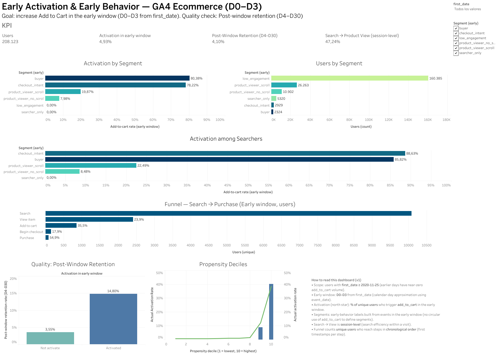

# GA4 — Early Activation Diagnostics (BigQuery + Tableau)

> English version: [README_EN.md](README_EN.md)

## Navegación rápida
- Dashboard público: https://public.tableau.com/views/EarlyActivationEarlyBehaviorGA4EcommerceD0D3/Dashboard1?:language=es-ES&:sid=&:redirect=auth&:display_count=n&:origin=viz_share_link
- Metodología: [`docs/methodology.md`](docs/methodology.md)
- Brief del proyecto: [`docs/project_brief.md`](docs/project_brief.md)
- Catálogo SQL: [`docs/sql_catalog.md`](docs/sql_catalog.md)
- Guía del dashboard: [`docs/dashboard_guide.md`](docs/dashboard_guide.md)
- Resumen ejecutivo: [`reports/executive_summary.md`](reports/executive_summary.md)
- Limitaciones y siguientes pasos: [`reports/limitations_and_next_steps.md`](reports/limitations_and_next_steps.md)

## Cómo leer este proyecto
Si quieres una visión rápida:
1. Lee este README
2. Abre el dashboard
3. Revisa el resumen ejecutivo
4. Si quieres más detalle técnico: metodología + SQL catalog

---

## Resumen
Este proyecto analiza **comportamiento temprano** de usuarios en un ecommerce (dataset público GA4) para entender qué señales se asocian con **activar** (hacer `add_to_cart`) y dónde se observa más caída en el flujo de **búsqueda → producto**.

**Dataset:** GA4 public sample ecommerce (BigQuery).  
**Cohorte (scope):** `first_date >= 2020-11-25`.  
**Ventana temprana (v1):** aproximación por día calendario con `event_date`: **D0–D3** desde `first_date`.

**Métrica principal:** **Add-to-cart rate (early window)** (usuarios únicos).  
**Métricas de diagnóstico:** Search → Product View rate (session-level), funnel secuencial de búsqueda, activación por segmentos tempranos y calibración de un modelo de propensión (BigQuery ML).

**Observaciones principales (a alto nivel):**
- En el funnel de búsqueda, la mayor caída se observa en **Search → View item**.
- En PDP, señales de engagement (p.ej. `view_item` + `scroll`) se asocian con mayor activación.
- El modelo de propensión ordena usuarios por probabilidad de activación; se usa como apoyo para priorización (no implica causalidad).

**Recomendaciones (en términos de hipótesis a validar):**
1) Explorar mejoras en **Search → View item** (relevancia, ranking, sugerencias, UX “no results”).  
2) Explorar mejoras en PDP (layout, performance, CTA visible, recomendaciones).  
3) Usar deciles de propensión para priorizar análisis/experimentos (no causal).

---

## Alcance del proyecto
Este repo está planteado como un **proyecto de portfolio** orientado a analítica de producto: definición de métricas, segmentación por comportamiento, funnels, un baseline de ML en BigQuery ML y un dashboard final en Tableau.  
No es un pipeline productivo ni un sistema de scoring desplegado.

---

## Arquitectura del proyecto / Data Flow
GA4 Public Dataset (BigQuery)  
↓  
SQL transformations (cohort definition, feature engineering, segmentación)  
↓  
BI-ready tables (user-level summaries, funnel tables, propensity deciles)  
↓  
Export a CSV (por límites de Tableau Public)  
↓  
Dashboard en Tableau Public

El procesamiento principal se realiza en BigQuery utilizando SQL.  
Las tablas finales se exportan como datasets agregados para visualización en Tableau.

---

## Feature table (simplificado)
Las tablas analíticas principales se construyen a **nivel usuario** usando `user_pseudo_id`.

Tabla conceptual (features early window, D0–D3):

| Campo | Descripción |
|------|-------------|
| user_pseudo_id | Identificador de usuario |
| first_date | Primera fecha observada |
| search_early | Usuario realizó búsqueda en ventana temprana |
| view_item_early | Usuario vio producto |
| scroll_early | Usuario hizo scroll en PDP |
| add_to_cart_early | Usuario añadió al carrito (métrica objetivo) |
| sessions_early | Nº de sesiones (por `ga_session_id`) en la ventana temprana |
| view_item_events_early | Nº de eventos `view_item` en la ventana temprana |
| segment_early | Segmento por reglas (buyer, checkout_intent, viewer_scroll, …) |
| retained_post_window_d30 | Actividad en D4–D30 (métrica post-ventana) |

Estas features se usan para:
- segmentación temprana
- análisis de funnel
- entrenamiento del modelo de propensión
- dataset final para Tableau

---

## Modelo de propensión (overview)
Se entrena un modelo baseline de **regresión logística** usando BigQuery ML.

**Objetivo:** predecir la probabilidad de que un usuario haga `add_to_cart` durante la ventana temprana (D0–D3).  
**Features:** flags de comportamiento (search, view_item, scroll, checkout/purchase), contadores ligeros (sesiones, eventos).  
**Lectura:** se generan **deciles de propensión** (`NTILE(10)`) sobre la probabilidad predicha para observar:
- ranking de usuarios por probabilidad de activación
- relación entre probabilidad predicha y tasa real de activación

El modelo se usa como **baseline de análisis/priorización**, no como sistema predictivo en producción.

---

## Métricas clave (snapshot)
Ejemplo de métricas observadas (scope: `first_date >= 2020-11-25`):

| Métrica | Valor |
|---|---:|
| Add-to-cart rate (early window, D0–D3) | ~4.93% |
| Search → Product View rate (session-level, global) | ~46.88% |
| Funnel: Search → View item (user-level, secuencial) | ~23.89% |
| Funnel: View item → Add to cart (user-level, secuencial) | ~35.48% |
| Post-window retention (D4–D30) — activados | ~14.80% |
| Post-window retention (D4–D30) — no activados | ~3.55% |

Interpretación prudente: los números sugieren que el principal punto de caída está en **descubrimiento de producto** (Search → View item). Además, activar en ventana temprana se asocia con mayor actividad post-ventana (esto no implica causalidad).

---

## Entregables
- **Dashboard en Tableau** (resumen + diagnósticos)
- **Catálogo de SQL** (BigQuery): cohorte, segmentación, funnel, “what-if”, ML
- **Reportes** en `/reports` con definiciones e interpretación

## Estructura del repositorio
- `/sql` → queries de BigQuery usadas en el proyecto
- `/data` → CSVs agregados exportados para Tableau Public
- `/docs` → metodología, guía del dashboard, brief
- `/reports` → narrativa y resultados

## Cómo reproducir (rápido)
1) Ejecutar las queries en BigQuery (ver `/sql`).  
2) Exportar salidas “BI-ready” a CSV para Tableau Public (considerando límites de filas).  
3) Construir el dashboard en Tableau usando los CSV exportados.

---

## Skills demostradas en el proyecto
- SQL analítico (BigQuery)
- Cohortes, funnels y segmentación por comportamiento
- Feature engineering a nivel usuario
- Modelado ML baseline (BigQuery ML)
- Visualización (Tableau)
- Documentación técnica y trazabilidad

## Aprendizajes
- Definición de métricas y ventanas temporales
- Diferencias entre user-level y session-level
- Funnels secuenciales y lectura de drop-offs
- Correlación vs causalidad (what-if no causal)
- Importancia de documentar scope y limitaciones

## Posibles mejoras técnicas (v2)
- Definir una ventana “72h real” usando `event_timestamp` (en vez de aproximación por `event_date`) y comparar resultados.
- Separar más explícitamente ventana de observación (features) vs ventana de outcome (label) para evitar ambigüedades.
- Añadir segmentación por dispositivo/canal (si estuviera disponible) para comparar patrones.
- Probar un baseline adicional en BQML (p.ej. boosted trees) y evaluar con un split temporal (no solo random).

---

## Nota de transparencia (IA)
Este es uno de mis primeros proyectos end-to-end de analítica de producto.  
He utilizado **ChatGPT/IA como apoyo** para iterar sobre documentación, naming y estructura de queries (manteniendo yo la ejecución, validación de resultados y decisiones analíticas).

---

## Dashboard
